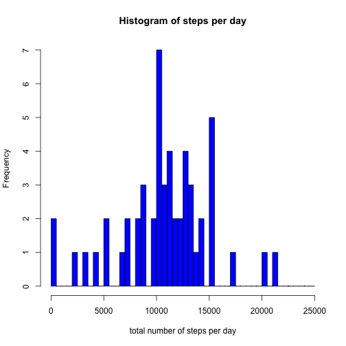
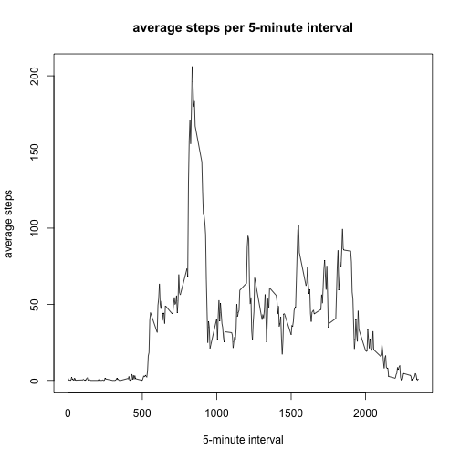
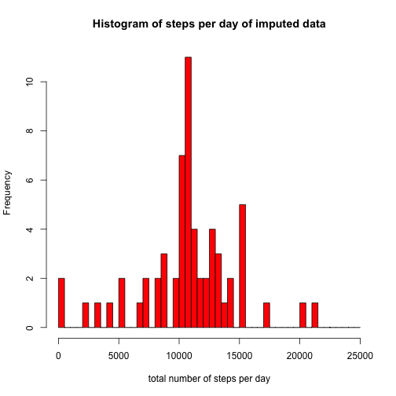
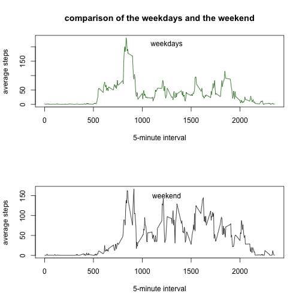

# Reproducible Research: Course Project 1

It is now possible to collect a large amount of data about personal movement using activity monitoring devices such as a Fitbit, Nike Fuelband, or Jawbone Up. These type of devices are part of the “quantified self” movement – a group of enthusiasts who take measurements about themselves regularly to improve their health, to find patterns in their behavior, or because they are tech geeks. But these data remain under-utilized both because the raw data are hard to obtain and there is a lack of statistical methods and software for processing and interpreting the data.

This device collects data at 5 minute intervals through out the day. The data consists of two months of data from an anonymous individual collected during the months of October and November, 2012 and include the number of steps taken in 5 minute intervals each day.

The variables included in this dataset are:

- steps: Number of steps taking in a 5-minute interval (missing values are coded as NA)
- date: The date on which the measurement was taken in YYYY-MM-DD format
- interval: Identifier for the 5-minute interval in which measurement was taken

The dataset is stored in a comma-separated-value (CSV) file and there are a total of 17,568 observations in this dataset.

### Loading and preprocessing the data

1. Load the data (i.e. read.csv())


```r
activity <- read.csv("activity.csv")
```

2. Process/transform the data (if necessary) into a format suitable for your analysis

The date variable is formatted from a factor variable to a date variable


```r
activity$date <- as.Date(activity$date, "%Y-%m-%d")
activity$steps <- as.numeric(activity$steps)
```

### What is mean total number of steps taken per day?

1. Calculate the total number of steps taken per day


```r
daysteps <- aggregate(activity$steps, by=list(activity$date), sum)
```

2. Make a histogram of the total number of steps taken each day

First calculate the maximum to find the right number of breaks and then make the histogram.


```r
max(daysteps$x, na.rm = TRUE)
```

```
## [1] 21194
```

```r
hist(daysteps$x, breaks=c(seq(0,25000,500)),
     col="blue", main="Histogram of steps per day", xlab="total number of steps per day")
```



3. Calculate and report the mean and median of the total number of steps taken per day


```r
meandaysteps <- mean(daysteps$x, na.rm = TRUE)
meandaysteps
```

```
## [1] 10766.19
```

```r
mediandaysteps <- median(daysteps$x, na.rm = TRUE)
mediandaysteps
```

```
## [1] 10765
```

### What is the average daily activity pattern?

1. Make a time series plot of the 5-minute interval and the average number of steps taken, averaged across all days

First calculate the average number of steps taken for every interval and then plot the time series.


```r
intervalsteps <- aggregate(activity$steps, by=list(activity$interval), mean, na.rm=TRUE)
plot(unique(activity$interval),intervalsteps$x,
     type="l", main="average steps per 5-minute interval", xlab="5-minute interval", ylab="average steps")
```



2. Which 5-minute interval, on average across all the days in the dataset, contains the maximum number of steps?


```r
intervalsteps[intervalsteps$x==max(intervalsteps$x),]
```

```
##     Group.1        x
## 104     835 206.1698
```

The 5-minute interval from 08:35 contains the maximum number of steps.

### Imputing missing values

1. Calculate and report the total number of missing values in the dataset.


```r
sum(is.na(activity$steps))
```

```
## [1] 2304
```

2. Devise a strategy for filling in all of the missing values in the dataset.

The strategy to fill the missing values is the mean of 5-minute intervall: intervalsteps.

3. Create a new dataset that is equal to the original dataset but with the missing data filled in.

The new dataset is new_activity.


```r
new_activity <- activity
for(i in 1:nrow(new_activity)){
        if (is.na(new_activity$steps[i])) {
                new_activity$steps[i] <- intervalsteps$x[intervalsteps$Group.1==new_activity$interval[i]]
                }
}
```

4. Make a histogram of the total number of steps taken each day and Calculate and report the mean and median total number of steps taken per day. Do these values differ from the estimates from the first part of the assignment? What is the impact of imputing missing data on the estimates of the total daily number of steps?


```r
hist(daysteps$x, breaks=c(seq(0,25000,500)),
     col="blue", main="Histogram of steps per day", xlab="total number of steps per day")
```


```r
new_daysteps <- aggregate(new_activity$steps, by=list(new_activity$date), sum)
hist(new_daysteps$x, breaks=c(seq(0,25000,500)),
     col="red", main="Histogram of steps per day of imputed data", xlab="total number of steps per day")
```



```r
new_meandaysteps <- mean(new_daysteps$x, na.rm = TRUE)
new_mediandaysteps <- median(new_daysteps$x, na.rm = TRUE)
meandaysteps <- mean(daysteps$x, na.rm = TRUE)
mediandaysteps <- median(daysteps$x, na.rm = TRUE)

tmean <- as.data.frame(meandaysteps)
tmean <- cbind(tmean, new_meandaysteps)
names(tmean) <- c("mean original data", "mean new data")
tmean
```

```
##   mean original data mean new data
## 1           10766.19      10766.19
```

```r
tmedian <- as.data.frame(mediandaysteps)
tmedian <- cbind(tmedian, new_mediandaysteps)
names(tmedian) <- c("median original data","median new data")
tmedian
```

```
##   median original data median new data
## 1                10765        10766.19
```

The mean of the new dataset doesn't differ from the original dataset.
The median differ a little, the median of the new data set is 1.19 higher than the one from the original dataset.

In the comparison of the histograms the two bars with the most frequencies are higher for the imputed data.

### Are there differences in activity patterns between weekdays and weekends?

1. Create a new factor variable in the dataset with two levels – “weekday” and “weekend” indicating whether a given date is a weekday or weekend day.


```r
new_activity$weekday <- "Y"
for(j in 1:nrow(new_activity)) {
        if(weekdays(new_activity$date[j]) %in% c("Samstag","Sonntag")){
        new_activity$weekday[j] <- "N"
        }
}
new_activity$weekday <- as.factor(new_activity$weekday)
```

2. Make a panel plot containing a time series plot of the 5-minute interval and the average number of steps taken, averaged across all weekday days or weekend days.


```r
average_weekdays <- aggregate(new_activity$steps[new_activity$weekday=="Y"], 
                              by=list(new_activity$interval[new_activity$weekday=="Y"]), mean, na.rm=TRUE)
average_weekend <- aggregate(new_activity$steps[new_activity$weekday=="N"], 
                             by=list(new_activity$interval[new_activity$weekday=="N"]), mean, na.rm=TRUE)
par(mfrow=c(2,1))
plot(unique(new_activity$interval), average_weekdays$x,
     type="l", xlab="5-minute interval", ylab="average steps",
     col = "darkgreen", main = "comparison of the weekdays and the weekend")
text(1250, 210, c("weekdays"))
plot(unique(new_activity$interval), average_weekend$x,
     type="l", xlab="5-minute interval", ylab="average steps", col = "black")
text(1250, 150, c("weekend"))
```



```r
par(mfrow=c(1,1))
```

On weekdays there is one peak, but it is higher than on weekend, but after this peak there are few steps in average.
On weekends the average steps start later, the steps are taken all over the day and end later.
